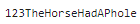
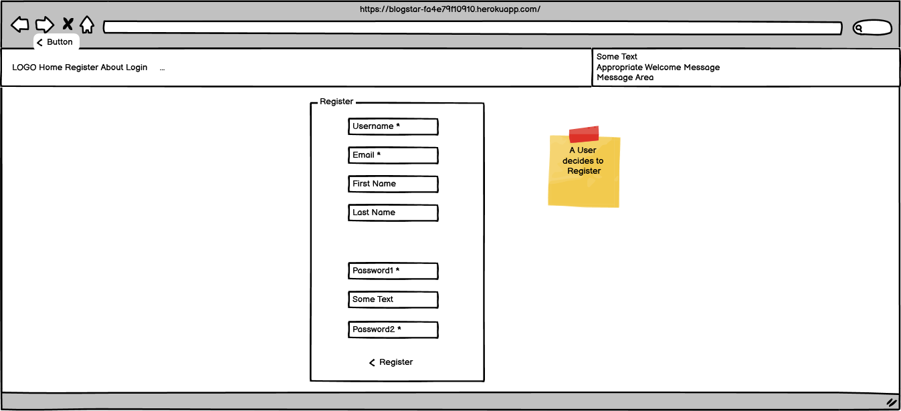
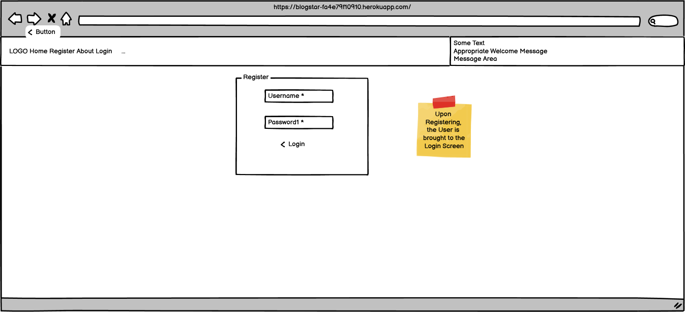
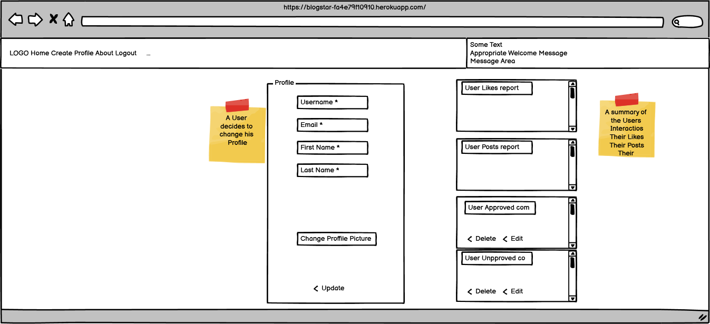
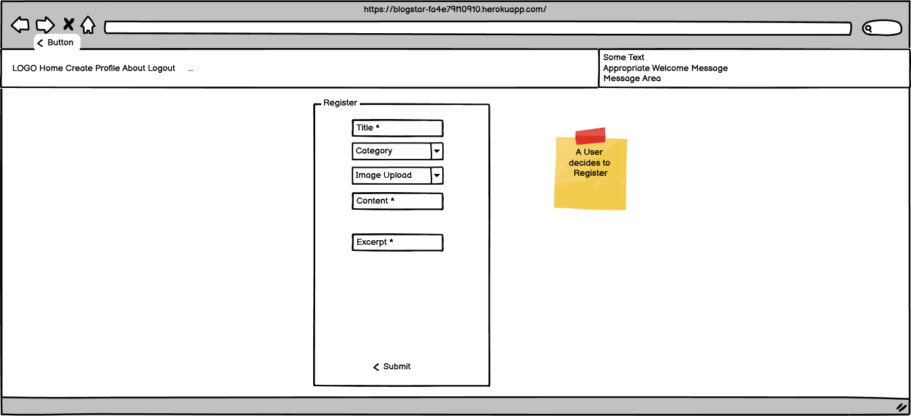
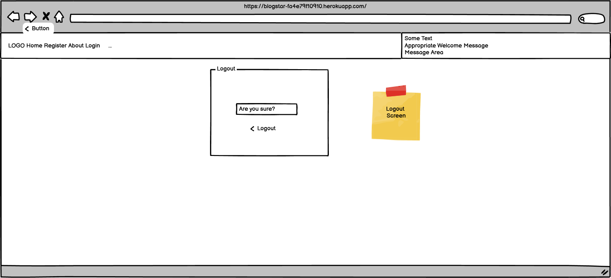
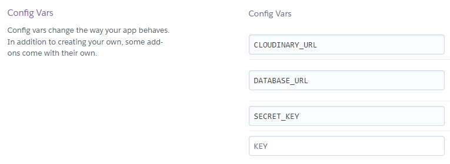

# Project Background

<details>

<summary>Overview</summary>

- This Django web development project is an extension of Code Institute, "I Think Therefore I Blog". 
- Unfortunately, for 95% of my development time, I confused, create a custom *model* with creating a custom *app*.  So at the 12<sup>th</sup> hour, I had to create a custom model: **Category**.  I integrated this into the masthead of each post and made it a mandatory dropdown selection for all posts.

- To demonstrate frontend CRUD I extended the Comment Edit/Delete to User Posts.  
- The original concept was to create Posts on the backend and allow registered users to create and delete comments on the frontend.  These comments were subject to approval of the site owner.  
- I have given the User the ability to have a Profile Page so they can add/change their Profile Picture, their Username, Email, First Name and Last Name.
	- This required me to add signals.py in the users app.  users.models.profile is a ManyToMany table and connects the django model User to the Cloudinary model CloudinaryField.  When the user adds a picture to their profile, the signal makes an entry in Profile.  Otherwise, when a user changed their profile picture, the Admin would have to connect their picture to their profile manually.

- Their Profile Page consolidates the Posts that they liked and gives them ability to Edit/Delete the comments that they've submitted and UNLIKE Liked Posts
- Users can also submit a Post of their own, making it more community driven
- I have also included a Category feature which allows Users to categorise their Posts.  This feature needs further development in order to produce more meaniingful reports or summaries
- From an Admin perspective, when the Admin is logged in, they have the ability to use a URL to login to djangos Admin feature.  The Admin retains full control over User Comments and User Posts as they need to be Approved by Admin before User contributions are published on the site for visitors and other Users.  Likes are not controlled by the Admin

## Personas:
1. Anonymous - Not Registerd or Registered but not Logged In
1. User - Registered AND Logged In
1. django superuser - Registered AND Logged In as Admin with password 

## Original Persona Capabilities
1. Anonymous people can: 
    - Read the site 
    - Register
    - Collaborate

1. User:
- In addition to the Anonymous capabilities they can:
    1. Login
    1. Logout
    1. Like/Unlike a Post
    1. Edit/Delete their own Comment(s)

3. django superuser (Admin):
- In addition to the User capabilities they can:
    1. Use django backend /admin

## New Persona Capabilities
1. Anonymous: 
    1. no changes

1. User:
- I added a CREATE page and a PROFILE page.
    - In the CREATE page, Users can:
    - Create a post with a Title*, Category*, Image, Content* and Excerpt 
    - Upon submittal of a post they get a "Post created!" success message and are redirected to the post_detail of the post they created.
    - The post is written to the Post Model with the username, slug, and status of *draft*.  Just like the original, the Admin must approve it so that he retains control of the content of the site while allowing Users the opportunity for greater participation.  
    - Once a Post is PUBLISHED, the User who created it can no longer Like, instead they can Delete/Edit their post  
    - In the Profile page users can now:
        1. Create/Update their: Username, Email, FirstName, LastName and profile picture
        1. View a list of Posts that they have Liked and can Unlike
        1. Update/Delete/View a list of Posts that they have submitted for approval
        1. Update/Delete/View a list of Posts that have been approved
        1. Update/Delete/View a list of Comments that they have submitted for approval
        1. Update/Delete/View a list of Comments that have been approved        
3. django superuser (Admin):
    - The django create superuser is: Admin and the password is: 
        1. For some of the features of the site you ***MUST*** login as Admin
            - I added an ADMIN link that brings you to /admin.
            - I wanted to add an APPROVE button to unapproved posts so that when logged in as Admin, posts could be approved on the frontend - a feature for the future!

</details>


## Agile Methodology

<summary>Personas</summary> 

- Developer - the person developing the product
- Anonymous User - a user who is not logged in, there are no stories for this visitor
- User - someone who has registered and logged in
- Admin - the Site Owner

</details>

<details>
<summary>Github</summary> 
Github was used for Planning, Recording and Sharing of all aspects of the project:

The [Project Elements:](https://github.com/users/DMASCoreDeclan/projects/20)
- [Code Repository](https://github.com/DMASCoreDeclan/PRD-PP4-Blog)
- [Version Control](https://github.com/DMASCoreDeclan/PRD-PP4-Blog) was used for version control of the code.  Regular [commits](https://github.com/DMASCoreDeclan/PRD-PP4-Blog/commits/main/) were created.  Where possible each commit was isolated to either a specific Issue but may have occassionally also included a minor change to some other part of the code
- [Milestones](https://github.com/users/DMASCoreDeclan/projects/20/views/3)
- [User Stories](https://github.com/users/DMASCoreDeclan/projects/20/views/10)
- [Kanban](https://github.com/users/DMASCoreDeclan/projects/20)
- [Labels](https://github.com/DMASCoreDeclan/PRD-PP4-Blog/labels)
- [Sizing](https://github.com/users/DMASCoreDeclan/projects/20/settings/fields/72230614) User Stories were sized using T-shirt sizing (XS, S, M, L, XL) 
- [MoSCow](https://github.com/users/DMASCoreDeclan/projects/20/views/7) Priorities are based on the MoSCoW method (Must have, Should have, Could have, Won't have)
</details>
</details>


## Wireframes
[Designed with Balsamiq Wireframes for Desktop](https://balsamiq.com/wireframes/desktop/)

Any vistor who has the URL can see the home sreen [blog|star Home](https://blogstar-fa4e79f10910.herokuapp.com/)

  <details>
  <summary>Home Screen (Anonymous User)</summary>  
  </details>

  <details>
  <summary>Register</summary>  
  </details>

  <details>
  <summary>Login</summary>  
  </details>

  <details>
  <summary> Home Screen (Logged in as Admin)</summary>  
  </details>

  <details>
  <summary> Home Screen (Logged in User)</summary>  
  </details>

  <details>
  <summary>Profile</summary>  
  </details>

  <details>
  <summary>Create Post</summary>  
  </details>

  <details>
  <summary>Edit Comment</summary>  
  </details>

  <details>
  <summary>Logout</summary>  
  </details>

<br>
<br>

</details>
 
## Entity Relationship Diagram
[Designed with Lucidchart](https://www.lucidchart.com/pages/)

<details>
<summary>ERD</summary>  
</details>

<details>
<summary>Project - Blogstar</summary>

Blogstar is the django Project.  By default it uses SQLite but we're using PostgreSQL instead.

There are three apps within the project:

1. blog
1. about
1. users
1. external apps

<details>
<summary>App - blog</summary>

- `blog` models: `Post`, `Comment` and `Category`
- `blog` forms: `CommentForm`, `CategoryForm` and `PostForm`
- `blog` views: `PostList`, `PostLike`, `PostCreate`, 
- `blog` pages: `index.html`, `post_detail.html`, `edit_comment.html` and `post_create.html`

</details>

<details>
<summary>App - about</summary>

- `about` models:  `About` and `CollaborateRequest`
- `about` forms: `CollaborateForm`
- `about` views: `about_me`
- `about` pages: `about.html`

</details>

<details>
<summary>App - users</summary>

- `users` models: `Profile`.
- `users` forms: `UserRegisterForm`, `UserUpdateForm` and `ProfileUpdateForm`
- `users` views: `register`, `profile`, `comment_delete`, `register`, `register`, `register`, `register`
- `users` pages: ``

</details>

<details>
<summary>external - alauth, cloudinary </summary>

- There is one model in `users` called `Profile`.

</details>

</details>

</details>


<summary>I logged into every URL and every Form as an Anonymous User, a User and as Admin</summary>


## Testing
- All testing is manual.

- I did the [following](  https://github.com/DMASCoreDeclan/PRD-PP4-Blog/tree/main/.ReadMe_Docs/BUG_REPORT.md) tests on Chrome.
I logged into every URL and every Form as an Anonymous User, a User and as Admin


</details>

The bugs were either fixed using an update of CSS, however, there were/are some [bugs](https://github.com/users/DMASCoreDeclan/projects/20/views/13) that have been recorded in git hub

## Roadmap - Stories

<details>
<summary>Site Owner User Story: APPROVE Draft Posts from the front end</summary>

[Site Owner User Story: APPROVE Draft Posts from the front end](https://github.com/DMASCoreDeclan/PRD-PP4-Blog/issues/37)

</details>

<details>
<summary>Site Owner User Story: Extend superuser to users other than "Admin"</summary>

[Site Owner User Story: Extend superuser to users other than "Admin"](https://github.com/DMASCoreDeclan/PRD-PP4-Blog/issues/38)

</details>

<details>
<summary>Site Owner User Story: APPROVE Draft Comments from the front end</summary>

[Site Owner User Story: APPROVE Draft Comments from the front end](https://github.com/DMASCoreDeclan/PRD-PP4-Blog/issues/39)

</details>

<details>
<summary>Site Owner User Story: Password Reset</summary>

[Site Owner User Story: Password Reset](https://github.com/DMASCoreDeclan/PRD-PP4-Blog/issues/40)

</details>

# Technologies Used

This section outlines the various technologies used throughout the project and the purpose each serves.

## Core Development Technologies

<details>

- [Django](https://www.djangoproject.com/) used as a full-stack framwork for developing the app.
- [JavaScript](https://www.ecma-international.org/publications-and-standards/standards/ecma-262/) used for client-side interaction and validation.
- [HTML](https://html.spec.whatwg.org/)/[CSS](https://www.w3.org/Style/CSS/Overview.en.html) + [Django Template Language](https://docs.djangoproject.com/en/4.2/ref/templates/language/) used for building out site pages.

</details>

## Python/Django Packages, Libraries, Frameworks and CDNs

<details>

- [cloudinary](https://pypi.org/project/django-cloudinary-storage/) - Django Cloudinary Storage is a Django package that facilitates integration with Cloudinary by implementing Django Storage API. You can use Cloudinary for both media and static file
- [crispy-bootstrap5](https://django-crispy-forms.readthedocs.io/en/latest/) - Django-crispy-forms provides you with a |crispy filter and  tag that will let you control the rendering behavior of your Django forms in a very elegant and DRY way
- [dj-database-url](https://pypi.org/project/dj-database-url/) - This simple Django utility allows you to utilize the 12factor inspired DATABASE_URL environment variable to configure your Django application.
- [dj3-cloudinary-storage](https://pypi.org/project/dj3-cloudinary-storage/) - Django Cloudinary Storage is a Django package that facilitates integration with Cloudinary by implementing Django Storage API
- [django-allauth](https://docs.allauth.org/en/latest/) - A fully integrated Django authentication app that allows for both local and social authentication, with flows that just work, beautifully!
- [django-crispy-forms](https://django-crispy-forms.readthedocs.io/en/latest/) - Django-crispy-forms provides you with a |crispy filter and  tag that will let you control the rendering behavior of your Django forms in a very elegant and DRY way
- [django-summernote](https://pypi.org/project/django-summernote/) - Summernote is a JavaScript library that helps you create WYSIWYG editors online.
- [gunicorn](https://gunicorn.org/) - Gunicorn 'Green Unicorn' is a Python WSGI HTTP Server for UNIX
- [oauthlib](https://pypi.org/project/oauthlib/) - A generic, spec-compliant, thorough implementation of the OAuth request-signing logic
- [psycopg2](https://pypi.org/project/psycopg2/) - Psycopg is the most popular PostgreSQL database adapter for the Python programming language
- [PyJWT](https://pyjwt.readthedocs.io/) - Python library which allows you to encode and decode JSON Web Tokens (JWT)
- [FavIcon](https://favicon.io/) - Quickly generate your favicon from text, image, or choose from hundreds of emoji
- [Google Fonts](https://fonts.google.com/) - High-quality google fonts to use on your web site.
- [Font Awesome](https://fontawesome.com/) - Font Awesome is the Internet's icon library and toolkit, used by millions of designers, developers, and content creators
- [Bootstrap 5](https://getbootstrap.com/docs/5.0/getting-started/introduction/) - Get started with Bootstrap, the world’s most popular framework for building responsive, mobile-first sites

</details>

## Infrastructural Technologies

<details>

- [PostgreSQL](https://www.postgresql.org/docs/12/) Current version provided by [Code Institute PostgresSQL](https://dbs.ci-dbs.net//)   (Originally on [ElephantSQL](https://www.elephantsql.com/) until v12 became unavailable.)  
- [Heroku](https://www.heroku.com/) - used for hosting the application.
- [Cloudinary](https://cloudinary.com/) - used for storing static files and media files.

</details>


<details>

# Table of Contents
- [Project Background](#Project-Background)
    - [👀 Overview](#-overview)
- [🔁 Process](#-process)
    - [❓ Problem Statement:](#-problem-statement)
    - [🔎 Research](#-research)
    - [🎨 Design](#-design)
    - [👨‍💻 Development](#-development)
      - [📈 Link to the GitHub Project board](#-link-to-the-github-project-board)
      - [👤 User Stories](#-user-stories)
    - [🧮 Data Models](#-data-models)
-
- [🛣️ Roadmap](#️-roadmap)
- [🪲 Bugs](#-bugs)
- [⚙️ Technologies Used](#️-technologies-used)
  - [💾 Core Development Technologies](#-core-development-technologies)
  - [📚 Libraries, Frameworks and Packages](#-libraries-frameworks-and-packages)
  - [🐍 Python/Django Packages](#-pythondjango-packages)
  - [🖥️ Infrastructural Technologies](#️-infrastructural-technologies)
- [🧪 Testing](#-testing)
  - [🤖 Automatic Testing](#-automatic-testing)
  - [⚒️ Manual Testing](#️-manual-testing)
    - [🛰️ Overview](#️-overview)
    - [🧪 General Testing](#-general-testing)
    - [🏠 Homepage \& Search Testing](#-homepage--search-testing)
    - [✈️ Flight Search Results Testing](#️-flight-search-results-testing)
    - [💵 Payment \& Confirmation Testing](#-payment--confirmation-testing)
    - [🔒 Authorisation Testing](#-authorisation-testing)
    - [🚦 Lighthouse Testing](#-lighthouse-testing)
    - [📱 Responsiveness Testing](#-responsiveness-testing)
    - [✅ Code Validation](#-code-validation)
- [🖥️ Deployment](#️-deployment)
  - [📦 Local Deployment](#-local-deployment)
  - [💜 Heroku Deployment](#-heroku-deployment)
  - [📐 Environment Variables](#-environment-variables)
- [👋 Credits](#-credits)


# 🔁 Process

- The development process was carried out using an Agile methodology with a focus on iterative development and continuous improvement.
- The project was managed using GitHub Project boards with user stories and tasks.  [GitHub Project](https://github.com/users/DMASCoreDeclan/projects/20/views/1)
- .

####  

####  User Stories [GitHub User board](https://github.com/users/DMASCoreDeclan/projects/20/views/10)

<details>
I divided the User Stories into 3 types

- Developer Stories - Developer prerequistes in order for the django to run ie Heroku, ElephandSQL and Github
- Site Owner Stories - The underlying features that the Site Owner wanted
- User Stories - The User Experience of the site


### 🧮 Data Models

<details>

The data models for the project are shown below:


- Users app:
  - `User` - custom user model which extends the Django `AbstractUser` model. Default username field is replaced with email field.

<br>

- Core app:
  - `Flight` - represents a flight. Contains origin, destination, outbound date, flight number, aircraft, departure time, arrival time and price.
  - `Booking` - represents a booking. Contains user, trip email, flight(s), fare(s), booking reference number, booking date, total price and status.
  - `Passenger` - represents Passengers associated with a Booking. Contains first name, last name and Booking id.
  - `Airport` - represents an airport. Contains name, IATA code, locality, region and country.
  - `Aircraft` - represents aircraft flow for a given flight. Contains aircraft model/type, identification and number of seats. Note: The Aircraft model was originally implemented with the intention of using it to implement seat selection functionality and options for seating and fares configurations. However, this was not implemented due to time constraints and potential for scope creep.

<br>

- Blog app:
  - `BlogPost` - represents a blog post. Contains title, image, content, date created and content rendered which is required to render content created with a Markdown field. The Markdown field was added to the admin panel to allow for content formatting/styling.

<br>

</details>

---
- The Checkout page shows the Order Summary and the Payment Details form.
- The Order Summary is populated with the flight and fare information stored in session storage.
- For the purposes of this project, the Payment Details form is a mockup and does not process any payments. The form is lightly validated on the front-end using the Payform library with some minor modification to allow for dummy card data to be entered.

<details>
<summary>Checkout page</summary>


</details>
</details>

### ✅ Confirmation

<details>

- The Confirmation page shows the user's booking reference number and a confirmation message.
- A CTA button is shown which allows the user to view their bookings.

<details>
<summary>Confirmation page</summary>


</details>
</details>

### 📜 Bookings

<details>

- The Bookings page shows a list of the user's bookings.
- An Edit button is shown for each booking which allows the user to edit the booking's passengers.
- The Booking detail page shows the booking's details and the passenger details.

<details>
<summary>Bookings page</summary>


</details>
</details>

#### ❌ Cancel Booking

<details>

- The user can cancel a booking by clicking the "Cancel Booking" button on the Booking detail page.
- This deletes the booking from the database by sending an AJAX request to the server and redirects the user to the Bookings page.
  A confirmation dialog is shown to the user to confirm that they want to cancel the booking.

<details>
<summary>Cancel Booking</summary>


</details>
</details>

#### 👥 Edit Passengers

<details>

- The user can edit a booking's passengers by clicking the "Edit Passengers" button on the Booking detail page.
- This sends an AJAX request (via htmx) to the server and loads the Passengers form with the booking's passenger data pre-populated.
- The user can then edit the passenger data and submit the form to update the booking's passenger data, or cancel the edit and return to the Booking detail page.

</details>

### 🌐 Blog

<details>

- The Blog is basic in design and is not a focus of this project.
- The Blog page shows a list of blog posts which were generated using the ChatGPT.
- The Blog detail page shows the blog post's title, image and content.
- New blog posts can be added via the Django Admin dashboard.

<details>
<summary>Blog page</summary>


</details>
</details>

### 🤔 About

<details>

- The About page shows a brief description of the project and the technologies used.

<details>
<summary>About page</summary>


</details>
</details>

---

<br>
<br>
<br>


---

<br>
<br>
<br>

# 🪲 Bugs

<details>

1. When styling the flight search result cards, there was some difficulty in adding a transition to animate the expansion of the card when clicked, to show the fares. It was found that it is not possible to transition from `display:hidden`, nor is it possible to transition from `height:0` to `height:auto`. A workaround was implemented by setting `max-height:0` with `overflow:hidden` then using JavaScript to add `max-height:100rem` (or any other large value) along with `transition:all` to animate the card expansion and collapse.
2. The "alternate date selector" on the flight results page works by sending an AJAX request (via htmx) when an alternate date is clicked, and responding with HTML with the new flight data for the given date. When the new HTML is loaded from the response, the click event listeners need to be re-attached to the new flight card elements so that they expand when clicked, to show the fares. However, when initially trying to implement this re-attachment, an issue arose where the flight cards would not expand every second time an alternate date was selected. Following some troubleshooting, it was found that the click event listeners were compounding, thus negating each other (i.e. as if a user clicked the card twice in rapid succession). Using `console.log` and Chrome Dev Tools for debugging enabled me to see which events were firing so that the issue could be identified and solved by defining the click handler function outside of the event listner function. [Relevant Stack Overflow thread.](https://stackoverflow.com/questions/41720943/rebind-javascript-events-and-addeventlistener-fires-twice)
3. The `Flight`s table contains 90,000 rows of data and when implementing the `Booking`s CRUD functionality, there were severe issues experienced particularly in the admin panel when trying to view/edit `Booking`s which resulted in indefinite loading times as the `Flight`s data was loaded. Django has a number of built-in solutions for this issue and a solution was implemented by defining `search_fields` and `autocomplete_fields` in the `ModelAdmin` configurations for the `Flight` and `Booking` models. [Django Documentation Reference](https://docs.djangoproject.com/en/4.2/ref/contrib/admin/#django.contrib.admin.ModelAdmin.autocomplete_fields)
4. When testing the site on mobile, a bug was identified where the date input field placeholder text would not display. Following some research and troubleshooting, it was found that this is a known issue with Flatpickr and a workaround was found as [referenced in this JSfiddle](https://jsfiddle.net/Sova12309/7bmpy9jc/9/).

<details>
<summary>Code Snippet Implemented to fix bug #4</summary>


```css
.flatpickr-mobile:before {
  content: attr(placeholder);
  color: #9ca3af;
  width: 100%;
}

.flatpickr-mobile:focus[value]:not([value=""]):before {
  display: none;
}

input[type="hidden"][value]:not([value=""]) + .flatpickr-mobile:before {
  display: none;
}
```

</details>

<br>

5. When testing the alternate date selection feature, a bug was identified where the "No flights on selected date" error message would not disappear during the transition between a newly selected alternate date. Additionally, if the fares container was expanded for a flight, it would remain visible during the request when selecting a new date. The loading indicator would display during the request, but would push the error message/fares container down. The intended behaviour was for all content - including flights, fares and error messages - to be hidden during a request, and for the loading indicator to display. Some time was spent troubleshooting the `htmx` implementation, however it was found that all that needed to be done was add `classList.add('hidden')` to these elements when an alternate date was clicked, as I had done for the flight cards already in the earlier stages of development. This was a simple fix and a reminder to always ensure code is clean and well documented, as I had already forgotten how I had implemented this functionality on the flight cards by the time I was reaching the latter stages of development.

<details>
<summary>Screenshot of bug #5</summary>


</details>

6. When testing the site on mobile, a bug was identified where when clicking on the search form input fields (origin, destination, dates), the keyboard displayed which was not intented as the user must select from the dropdown menu/date picker. This was solved by adding `readonly` to the input fields. Future iterations of the site will allow for user keyboard input, however this was not implemented due to time constraints and potential for scope creep.
7. Fixing bug #6 resulted in a new bug where a user could submit the search form without entering any data. This was solved by adding a simple piece of logic which removes the `readonly` attribute before validating the form, to check that the input values are valid before submitting.

<details>
<summary>Code snippet added to fix bug #7</summary>

```javascript
// SEARCH FORM VALIDATION
const validateForm = function (e) {
  e.preventDefault();

  // NEW CODE SNIPPET ADDED TO FUNCTION
  document.querySelectorAll("input").forEach((input) => {
    input.removeAttribute("readonly");
  });

  ...

  // REST OF FUNCTION...
  ...
}

```
</details>
<br>

8. Performance issues were identified with slow page loading speeds noted when accessing a user's Bookings page. Django Debug Toolbar helped to identify inefficient database queries which were causing the performance issues. Queries were optimised by using `select_related` which brought the total load time from 4800ms to 120ms - a significant improvement.


</details>

---

<br>
<br>
<br>


---

<br>
<br>
<br>

# 🧪 Testing

## 🤖 Automatic Testing

<details>

- Automated unit tests were written for core back-end functionality of the app to test data validation and integrity, templates used, HTTP status codes, user input etc.
- 35 tests were written in total.
- The [`Coverage`](https://pypi.org/project/coverage/) package was used to assist in guiding test requirements.
- 100% coverage was achieved on the `core` models and views.
- Future plans to write unit tests for coverage on `blog` and `users` apps.

<details>
<summary>Test coverage report</summary>


</details>
</details>

## ⚒️ Manual Testing

### 🛰️ Overview

<details>

- Responsiveness was tested as per below table (go to section: [Responsiveness](#-responsiveness-testing))
- All HTML files were passed through the W3C validator with no errors
- All JavaScript files were passed through JSHint with no errors present.
- The website was tested on major browsers including Chrome, Safari, Firefox and Edge.
- All user flows were tested in depth including navigating through the booking flow, viewing blog content, entering search queries, clicking CTAs and links, and form submission.
- All forms were tested to ensure validation was present and that forms could be submitted without error
- Lighthouse was used to test for Performance, Accessibility, Best Practices and SEO and adjustments were made to improve test results.
- WAVE was used to test for accessibility issues and adjustments were made to improve test results.

</details>

---

### 🧪 General Testing

<details>
<summary>Expand test detail</summary>

| Test                  | Action                                                                                                                                                                                         | Success Criteria                                                              |
| --------------------- | ---------------------------------------------------------------------------------------------------------------------------------------------------------------------------------------------- | ----------------------------------------------------------------------------- |
| Homepage loads        | Navigate to website URL                                                                                                                                                                        | Page loads < 3s, no errors                                                    |
| Links                 | Click on each Navigation link, CTA, button, logo, footer link                                                                                                                                  | Correct page is loaded/correct action performed, new tab opened if applicable |
| Form validation       | Enter data into each input field, ensure only valid data is accepted                                                                                                                           | Form doesn't submit until correct data entered, error message shown           |
| Responsiveness        | Resize viewport window from 320px upwards with Chrome Dev Tools. Test devices as detailed in [Responsiveness Testing](#-responsiveness-testing)                                                               | Page layout remains intact and adapts to screen size as intended              |
| Lighthouse            | Perform Lighthouse test on each page for the primary user flow (Booking process)                                                                                                               | Score of > 89 on Performance, Accessibility, Best Practices                   |
| Browser compatibility | Test links, layout, appearance, functionality and above Tests on Chrome, Safari, Firefox and Edge. BrowserStack used to test various mobile/large format devices with recent browser versions. | Website looks and functions as intended and passes all tests above            |

</details>

---

### 🏠 Homepage & Search Testing

<details>
<summary>Expand test detail</summary>

| Test                         | Action                                                                                                             | Success Criteria                                                                                                                                                                                                                            |
| ---------------------------- | ------------------------------------------------------------------------------------------------------------------ | ------------------------------------------------------------------------------------------------------------------------------------------------------------------------------------------------------------------------------------------- |
| Origin/Destination selection | - Click Origin/Destination fields.                                                                                 | - Drop down menu opens with correct data.<br>- Text input disabled. <br>- Dropdown closes on click outside. <br>- Correct selection added to field.                                                                                         |
| Trip type selection          | - Select trip type (return/one-way)                                                                                | - One-way trip hides return date field. <br>- Return trip shows return date field.                                                                                                                                                          |
| Date selection               | - Click date field                                                                                                 | - On click, show date picker.<br>- Dates in the past disabled.<br>- Dates after 01-07-2024 disabled.<br>- Correct selection added to field.                                                                                                 |
| Passenger selection          | - Click passengers field                                                                                           | - Drop down menu displays with up to 8 passengers                                                                                                                                                                                           |
| Form submission              | - Fill in form and click submit button                                                                             | - Form submitted<br>- Flight results page loaded with correct data                                                                                                                                                                          |
| Validation                   | - Select same origin and destination<br>- Select return date before selected outbound date<br>- Leave fields blank | - Field validation message shown if same origin and destination<br>- Field validation message shown if return date before outbound date<br>- Field validation messages shown for blank fields<br>- Form does not submit until data is valid |

</details>

---

### ✈️ Flight Search Results Testing

<details>
<summary>Expand test detail</summary>

| Test            | Action                                               | Success Criteria                                                                                                           |
| --------------- | ---------------------------------------------------- | -------------------------------------------------------------------------------------------------------------------------- |
| Flight results  | - Review flight results                              | - Correct flight data shown                                                                                                |
| Alternate dates | - Select alternate dates for outbound/return flights | - Correct flight data fetched<br>- Correct dates added to selector<br>- Error message shown if same/invalid dates selected |
| Fare selection  | - Select a fare                                      | - Fares container expands on click<br>- Correct fare data shown<br>- Fare/flight selection works as intended               |
| Edit flight     | - Edit a flight selection                            | - When edit button clicked, flight results show and new flight can be selected                                             |
| Confirm flights | - Select flights and confirm                         | - When confirmed, date added to session storage and request sent                                                           |

</details>

---

### 💵 Payment & Confirmation Testing

<details>
<summary>Expand test detail</summary>

| Test            | Action                                               | Success Criteria                                                                                                           |
| --------------- | ---------------------------------------------------- | -------------------------------------------------------------------------------------------------------------------------- |
| Flight results  | - Review flight results                              | - Correct flight data shown                                                                                                |
| Alternate dates | - Select alternate dates for outbound/return flights | - Correct flight data fetched<br>- Correct dates added to selector<br>- Error message shown if same/invalid dates selected |
| Fare selection  | - Select a fare                                      | - Fares container expands on click<br>- Correct fare data shown<br>- Fare/flight selection works as intended               |
| Edit flight     | - Edit a flight selection                            | - When edit button clicked, flight results show and new flight can be selected                                             |
| Confirm flights | - Select flights and confirm                         | - When confirmed, date added to session storage and request sent                                                           |

</details>

---

### 🔒 Authorisation Testing

<details>
<summary>Expand test detail</summary>

| Test            | Action                                               | Success Criteria                                                                                                           |
| --------------- | ---------------------------------------------------- | -------------------------------------------------------------------------------------------------------------------------- | --- |
| Flight results  | - Review flight results                              | - Correct flight data shown                                                                                                |
| Alternate dates | - Select alternate dates for outbound/return flights | - Correct flight data fetched<br>- Correct dates added to selector<br>- Error message shown if same/invalid dates selected |
| Fare selection  | - Select a fare                                      | - Fares container expands on click<br>- Correct fare data shown<br>- Fare/flight selection works as intended               |
| Edit flight     | - Edit a flight selection                            | - When edit button clicked, flight results show and new flight can be selected                                             |
| Confirm flights | - Select flights and confirm                         | - When confirmed, date added to session storage and request sent                                                           |     |

</details>

---

### 🚦 Lighthouse Testing

<details>

- All pages were tested using Lighthouse with the primary goals of identifying performance and accessibility issues and ensuring adherance to best practices.
- The Lighthouse test results for each step of the `core` user flow are shown below:
<details>
<summary>Homepage</summary>


</details>
<details>
<summary>Flights</summary>


</details>
<details>
<summary>Passengers</summary>


</details>
<details>
<summary>Checkout</summary>


</details>
<details>
<summary>Bookings Overview</summary>


</details>
<details>
<summary>Booking Detail</summary>


</details>
</details>

---

### 📱 Responsiveness Testing

<details>

- Testing for responsiveness was conducted using Chrome Dev Tools and ResponsivelyApp.
- The website was tested extensively on a range of emulated mobile, tablet and large format screen sizes in both portrait and landscape orientations.
<details>
<summary>Responsiveness test results</summary>


</details>

| Device             | iPhone SE   | iPhone X    | iPhone 12 Pro | iPhone 13 Pro Max | iPhone 14 Pro Max | iPad         | iPad Air     | iPad Pro      | Macbook Pro  |
| ------------------ | ----------- | ----------- | ------------- | ----------------- | ----------------- | ------------ | ------------ | ------------- | ------------ |
| **Resolution**     | **375x667** | **375x812** | **390x844**   | **414x76**        | **414x896**       | **768x1024** | **820x1180** | **1024x1366** | **1440x900** |
| Render             | Pass        | Pass        | Pass          | Pass              | Pass              | Pass         | Pass         | Pass          | Pass         |
| Layout             | Pass        | Pass        | Pass          | Pass              | Pass              | Pass         | Pass         | Pass          | Pass         |
| Functionality      | Pass        | Pass        | Pass          | Pass              | Pass              | Pass         | Pass         | Pass          | Pass         |
| Links              | Pass        | Pass        | Pass          | Pass              | Pass              | Pass         | Pass         | Pass          | Pass         |
| Images             | Pass        | Pass        | Pass          | Pass              | Pass              | Pass         | Pass         | Pass          | Pass         |
| Portrait/Landscape | Pass        | Pass        | Pass          | Pass              | Pass              | Pass         | Pass         | Pass          | Pass         |

</details>

---

### ✅ Code Validation

<details>

- All HTML pages were checked with the [W3C Markup Validation Service](https://validator.w3.org/) with no major errors present. Errors were present for `htmx` attributes, however these are valid and necessary for the functionality of the site. There were also duplicate IDs present in the HTML, however these are also valid and necessary for the functionality of the site.
- All JavaScript files were passed through [JSHint](https://jshint.com/) with no errors present.
- All custom coded Python files were formatted with a PEP8 complaint formatter - [Black](https://pypi.org/project/black/).

- HTML Validation Examples:
  - [Homepage](https://validator.w3.org/nu/?doc=https%3A%2F%2Fflyux.carlmurray.design%2F)
  - [Search Results](https://validator.w3.org/nu/?doc=https%3A%2F%2Fflyux.carlmurray.design%2Fsearch_results%2F%3Fcsrfmiddlewaretoken%3D8KBZVKvX5lSOnxG31kPxxvzRddpEYACScsdbbPRenaPjeZT3OdKDnNFBofnKkoF4%26trip_type%3Dreturn%26origin%3DDublin%2B%2528DUB%2529%26destination%3DCork%2B%2528ORK%2529%26outbound_date%3D2023-08-30%26return_date%3D2023-08-31%26passengers%3D1)
  - [Checkout](https://validator.w3.org/nu/?doc=https%3A%2F%2Fflyux.carlmurray.design%2Fcheckout)
  - [Blog](https://validator.w3.org/nu/?doc=https%3A%2F%2Fflyux.carlmurray.design%2Fblog)


</details>

<br>
<br>
<br>

# 🖥️ Deployment

<details>

#### 📦 Local Deployment  
1. Clone the repository from GitHub by clicking the "Code" button and copying the URL.
1. Open your preferred IDE and open a terminal session in the directory you want to clone the repository to.
1. Type `git clone` followed by the URL you copied in step 1 and press enter.
1. Install the required dependencies by typing `pip install -r requirements.txt` in the terminal.
1. Note: The project is setup to use environment variables. You will need to set these up in your local environment. See [Sample Environment Variables](/env_sample.py) for more information.
1. Please also Note: This project uses a cloud based Postgress (min v12) database, you may use whatever database you wish
1. Connect your database of choice and run the migrations by typing `python3 manage.py migrate` in the terminal.
1. **The SUPERUSER MUST be "Admin" otherwise the url for the Admin will not apppear when you log in as the superuser**
1. Create a superuser by typing `python3 manage.py createsuperuser` in the terminal and follow the prompts.  
1. Optional: Fixtures for posts are held in `fixtures` directory. To add pre-populated data to the database, run `python3 manage.py loaddata blog/fixtures/posts.json`.
1. Run the app by typing `python3 manage.py runserver` in the terminal and opening the URL in your browser.

#### 💜 Heroku Deployment
1. Login to the [Heroku](https://dashboard.heroku.com/) dashboard and create a new app.
1. Connect your GitHub repository to your Heroku app.
1. In the Settings tab, ensure that the Python Buildpack is added.
1. Set environment variables in the Config Vars section of the Settings tab.  

1. In the Deploy tab, enable automatic deploys from your GitHub repository.
1. Click the "Deploy Branch" button to deploy the app.
1. Once the app has been deployed, click the "Open App" button to view the app.

#### 💜 Cloudinary Deployment
1. Login to [Cloudinary](https://cloudinary.com/)
1. From the Cloudinary Dashboard, copy the CLOUDINARY_URL and place in the local env.py and Config Vars on Heroku.

#### 📐 Environment Variables
- For local deployment, you will need to create a `.env` file in the root directory of the project and set the environment variables in this file.
- [Sample Environment Variables](/env_sample.py)
- For Heroku deployment, you will need to set the environment variables through the Heroku CLI or through the Heroku dashboard under 'Config Vars'.
- You need to define the following variables:
  - If using a Postgres database (must have v12 minimum, required gor gunicorn):
    - `DATABASE_URL` - the URL for your Postgres database.
  - Django settings:
    - `SECRET_KEY` - the secret key for your Django project.
    - `DEBUG` - set to `True` for development, `False` for production.
  - If using Cloudinary:
    - `CLOUDINARY_URL` - your Cloudinary access key ID.
    

</details>
  
<br>
<br>
<br>

---

# 👋 Credits

<details>


- [Favicon.io](https://favicon.io/) - used to create favicon.
- [Payform](https://github.com/jondavidjohn/payform) - used for Payment Details input formatting.
- As always, Antonio my mentor

</details> -->