# Project [blog|star](https://blogstar-fa4e79f10910.herokuapp.com/) 

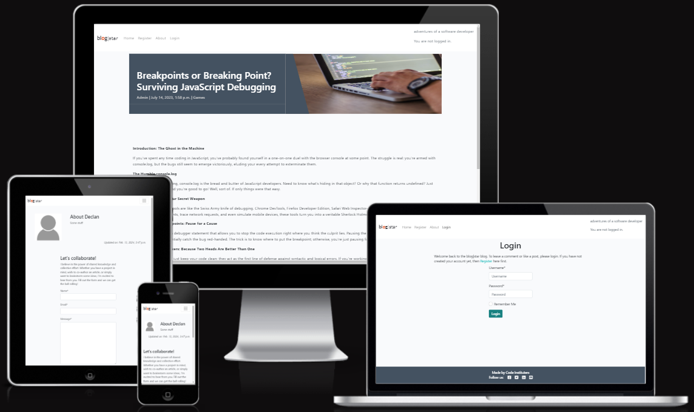

  * [Project Background](#project-background)
  * [Agile Methodology](#agile-methodology)
  
  * [Wireframes](#wireframes)
  * [Entity Relationship Diagram](#entity-relationship-diagram)
  * [Testing](#testing)
  * [Roadmap - Stories](#roadmap---stories)
- [Technologies Used](#technologies-used)
  * [Core Development Technologies](#core-development-technologies)
  * [Python/Django Packages, Libraries, Frameworks and CDNs](#python-django-packages--libraries--frameworks-and-cdns)
  * [Infrastructural Technologies](#infrastructural-technologies)
- [Credits](#credits)

<small><i><a href='http://ecotrust-canada.github.io/markdown-toc/'>Table of contents generated with markdown-toc</a></i></small>

## Project Background

Overview

- This Django web development project is an extension of Code Institute, "I Think Therefore I Blog". 
- Unfortunately, for 95% of my development time, I confused, create a custom *model* with creating a custom *app*.  So at the 12th hour, I had to create a custom model: **Category**.  I integrated this into the masthead of each post and made it a mandatory dropdown selection for all posts.

- The original concept was to create Posts on the backend and allow registered users to create and delete comments on the frontend.  These comments were subject to approval of the site owner.  
- I have given the User the ability to have a Profile Page so they can add/change their Profile Picture, their Username, Email, First Name and Last Name.
	- This required me to add signals.py in the users app.  users.models.profile is a ManyToMany table and connects the django model User to the Cloudinary model CloudinaryField.  When the user adds a picture to their profile, the signal makes an entry in Profile.  Otherwise, when a user changed their profile picture, the Admin would have to connect their picture to their profile manually.

- Their Profile Page consolidates the Posts that they liked and gives them ability to Edit/Delete the comments that they've submitted and UNLIKE Liked Posts
- Users can also [submit a Post](https://blogstar-fa4e79f10910.herokuapp.com/create/) of their own, making it more community driven
- To demonstrate frontend CRUD I extended the Comment Edit/Delete to User Posts.  
- I have also included a Category feature which allows Users to categorise their Posts.  This feature needs further development in order to produce more meaniingful reports or summaries
- From an Admin perspective, when the Admin is logged in, they have the ability to use a URL to login to [djangos Admin feature](https://blogstar-fa4e79f10910.herokuapp.com/admin/).  The Admin retains full control over User Comments and User Posts as they need to be Approved by Admin before User contributions are published on the site for visitors and other Users.  Likes are not controlled by the Admin

## Personas

1. Anonymous - Not Registerd or Registered but not Logged In
1. User - Registered AND Logged In
1. django superuser - Registered AND Logged In as Admin with password 

### Original Persona Capabilities
1. Anonymous people can: 
    - [Read the site](https://blogstar-fa4e79f10910.herokuapp.com/) 
    - [Register](https://blogstar-fa4e79f10910.herokuapp.com/register/)
    - [Collaborate](https://blogstar-fa4e79f10910.herokuapp.com/about/)

1. User:
- In addition to the Anonymous capabilities they can:
    1. [Login](https://blogstar-fa4e79f10910.herokuapp.com/accounts/login/)
    1. [Logout](https://blogstar-fa4e79f10910.herokuapp.com/accounts/logout/)
    1. Like/Unlike a Post
    
    1. Edit/Delete their own Comment(s)

3. django superuser (Admin):
- In addition to the User capabilities they can:
    1. Use django backend /admin

### New Persona Capabilities
1. Anonymous: 
    1. no changes

1. User:
- I added a [CREATE](https://blogstar-fa4e79f10910.herokuapp.com/create/) page and a [PROFILE](https://blogstar-fa4e79f10910.herokuapp.com/register/profile/) page.
    - In the CREATE page, Users can:
    - Create a post with a Title*, Category*, Image, Content* and Excerpt 
    - Upon submittal of a post they get a "Post created!" success message and are redirected to the post_detail of the post they created.
    - The post is written to the Post Model with the username, slug, and status of *draft*.  Just like the original, the Admin must approve it so that he retains control of the content of the site while allowing Users the opportunity for greater participation.  
    - Once a Post is PUBLISHED, the User who created it can no longer Like, instead they can Delete/Edit their post  
    - In the Profile page users can now:
        1. Create/Update their: Username, Email, FirstName, LastName and profile picture
        1. View a list of Posts that they have Liked and can Unlike
        1. Update/Delete/View a list of Posts that they have submitted for approval
        1. Update/Delete/View a list of Posts that have been approved
        1. Update/Delete/View a list of Comments that they have submitted for approval
        1. Update/Delete/View a list of Comments that have been approved        
3. django superuser (Admin):
    - The django create superuser is: Admin and the password is: 
        1. For some of the features of the site you ***MUST*** login as Admin
            - I added an ADMIN link that brings you to /admin.
            - I wanted to add an APPROVE button to unapproved posts so that when logged in as Admin, posts could be approved on the frontend - a feature for the future!

## Agile Methodology

Personas
 

- Developer - the person developing the product
- Anonymous User - a user who is not logged in, there are no stories for this visitor
- User - someone who has registered and logged in
- Admin - the Site Owner

Github
 
Github was used for Planning, Recording and Sharing of all aspects of the project:

The [Project Elements:](https://github.com/users/DMASCoreDeclan/projects/20)
- [Code Repository](https://github.com/DMASCoreDeclan/PRD-PP4-Blog)
- [Version Control](https://github.com/DMASCoreDeclan/PRD-PP4-Blog) was used for version control of the code.  Regular [commits](https://github.com/DMASCoreDeclan/PRD-PP4-Blog/commits/main/) were created.  Where possible each commit was isolated to either a specific Issue but may have occassionally also included a minor change to some other part of the code
- [Milestones](https://github.com/users/DMASCoreDeclan/projects/20/views/3)
- [User Stories](https://github.com/users/DMASCoreDeclan/projects/20/views/10)
- [Kanban](https://github.com/users/DMASCoreDeclan/projects/20)
- [Labels](https://github.com/DMASCoreDeclan/PRD-PP4-Blog/labels)
- [Sizing](https://github.com/users/DMASCoreDeclan/projects/20/settings/fields/72230614) User Stories were sized using T-shirt sizing (XS, S, M, L, XL) 
- [MoSCow](https://github.com/users/DMASCoreDeclan/projects/20/views/7) Priorities are based on the MoSCoW method (Must have, Should have, Could have, Won't have)

## Wireframes
[Designed with Balsamiq Wireframes for Desktop](https://balsamiq.com/wireframes/desktop/)

Any vistor who has the URL can see the home sreen [blog|star Home](https://blogstar-fa4e79f10910.herokuapp.com/)

  

  
Home Screen (Anonymous User)
  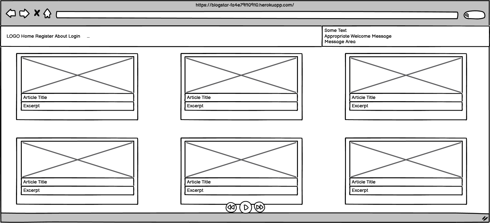
  

  

  
Register
  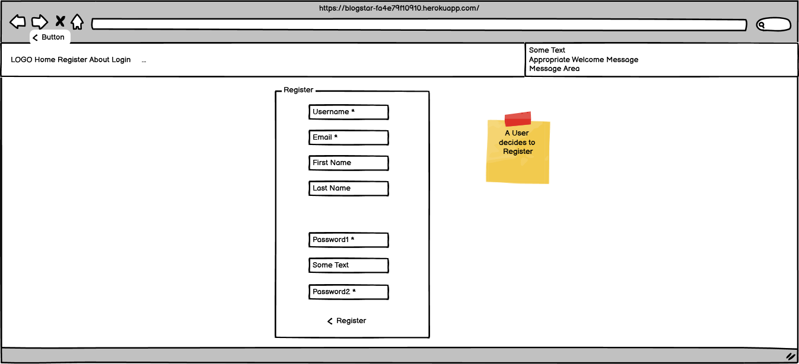
  

  

  
Login
  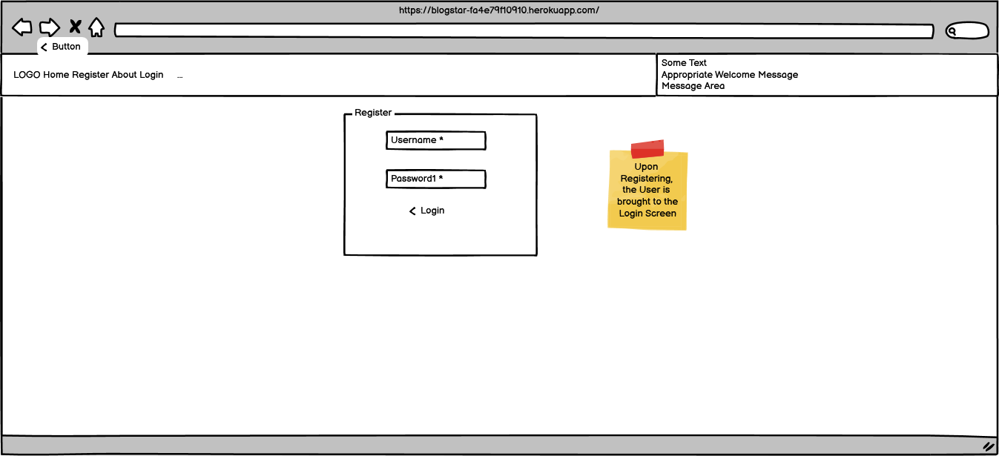
  

  

  
 Home Screen (Logged in as Admin)
  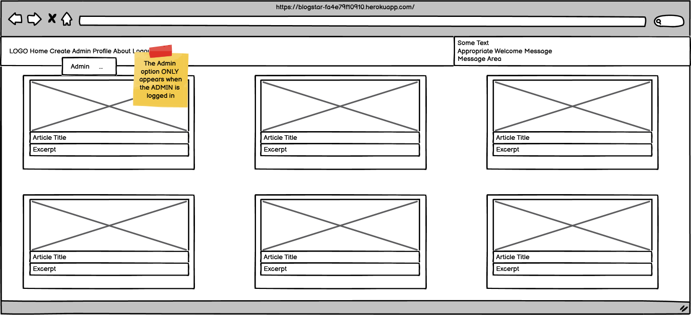
  

  

  
 Home Screen (Logged in User)
  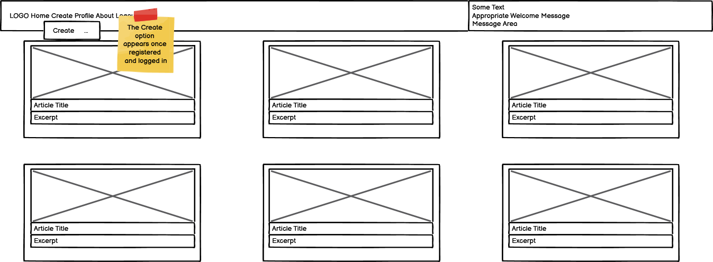
  

  

  
Profile
  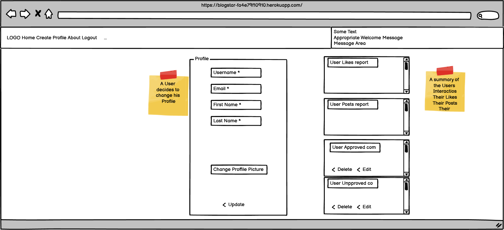
  

  

  
Create Post
  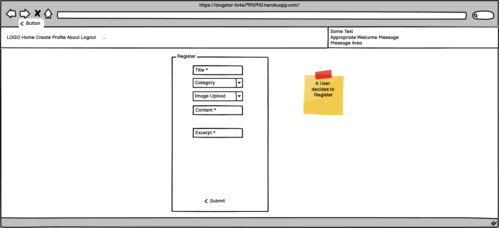
  

  

  
Edit Comment
  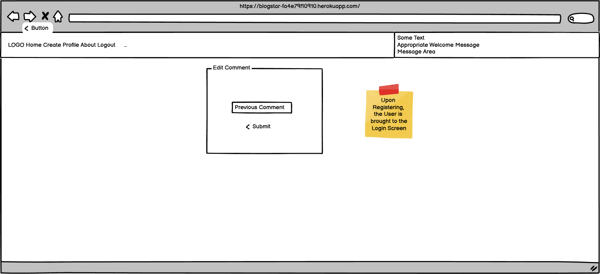
  

  

  
Logout
  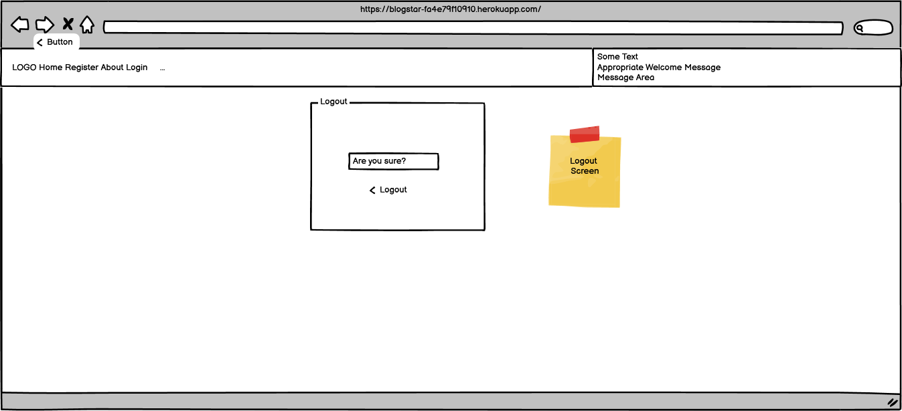
  

 
 

 
## Entity Relationship Diagram
[Designed with Lucidchart](https://www.lucidchart.com/pages/)

ERD
  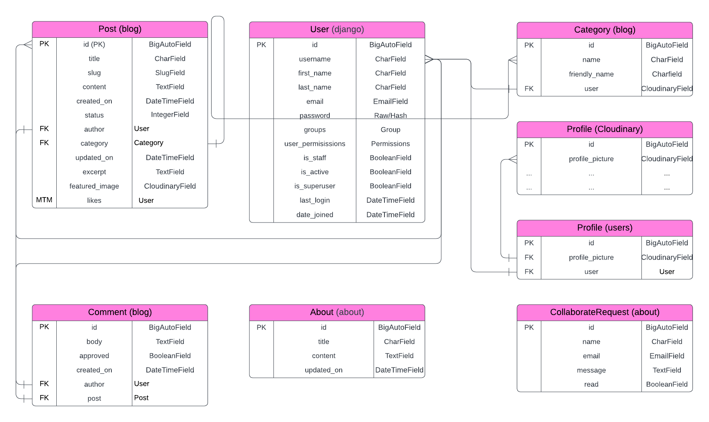

Project - Blogstar

Blogstar is the django Project.  By default it uses SQLite but we're using PostgreSQL instead.

There are three apps within the project:

1. blog
1. about
1. users
1. external apps

App - blog

- `blog` models: `Post`, `Comment` and `Category`
- `blog` forms: `CommentForm`, `CategoryForm` and `PostForm`
- `blog` views: `PostList`, `PostLike`, `PostCreate`, 
- `blog` pages: `index.html`, `post_detail.html`, `edit_comment.html` and `post_create.html`

App - about

- `about` models:  `About` and `CollaborateRequest`
- `about` forms: `CollaborateForm`
- `about` views: `about_me`
- `about` pages: `about.html`

App - users

- `users` models: `Profile`.
- `users` forms: `UserRegisterForm`, `UserUpdateForm` and `ProfileUpdateForm`
- `users` views: `register`, `profile`, `comment_delete`, `register`, `register`, `register`, `register`
- `users` pages: ``

external - alauth, cloudinary 

- There is one model in `users` called `Profile`.

## Testing

Test Case and Test Scenario

- All testing is manual.
- I logged into every URL and every Form as an Anonymous User, a User and as Admin.  After each action, I checked the console, and where appropriate, I checked the databae in /admin, to ensure the backend did as expected.  
- I performed [Test Case and Test Scenario testing](https://github.com/DMASCoreDeclan/PRD-PP4-Blog/tree/main/.ReadMe_Docs/BUG_REPORT.md) tests on Chrome.
- All bugs were [recorded](https://github.com/DMASCoreDeclan/PRD-PP4-Blog/tree/main/.ReadMe_Docs/BUG_REPORT.md) but divided into two types: 
	1. **Easy** to fix, misspellings or obvious ommissions, in .html/.py/.js/.css.  These were recorded, fixed on the fly and captured in a dedicated commit
	1. **Substantial** and may or may not be fixed.  These have a [Bug Issue in Github](https://github.com/users/DMASCoreDeclan/projects/20/views/13)

Responsiveness

- The website was viewed on a variety of devices such as Desktop, Laptop, iPhone 8, iPhone 11, iPad, and Androids to ensure responsiveness on various screen sizes. The website performed as intended. The responsive design was also checked using Chrome developer tools across multiple devices with structural integrity holding for the various sizes.

- [Am I responsive](https://ui.dev/amiresponsive?url=https://8000-dmascoredecl-prdpp4blog-8pcr8te1zt6.ws-eu108.gitpod.io/)
- [Responsinator](http://www.responsinator.com/?url=https%3A%2F%2F8000-dmascoredecl-prdpp4blog-8pcr8te1zt6.ws-eu108.gitpod.io%2F)

Code CI Python Linter

- [users.views.py ](https://github.com/DMASCoreDeclan/PRD-PP4-Blog/blob/main/.ReadMe_Docs/images/python-linter-for-user-views.png)
- [blog.views.py ](https://github.com/DMASCoreDeclan/PRD-PP4-Blog/tree/main/.ReadMe_Docs/images/python-linter-for-blog-views.png)
- [about.views.py ](https://github.com/DMASCoreDeclan/PRD-PP4-Blog/tree/main/.ReadMe_Docs/images/python-linter-for-settings.png) - I'm not fixing these, these are django inserted
- [users.views.py ](https://github.com/DMASCoreDeclan/PRD-PP4-Blog/tree/main/.ReadMe_Docs/images/python-linter-for-about-views.png)

W3C CSS Validator Result

No errors were returned when passing through the official W3C CSS Validator 

[W3C CSS Validator Results](https://jigsaw.w3.org/css-validator/validator?uri=https%3A%2F%2Fblogstar-fa4e79f10910.herokuapp.com%2F&profile=css3svg&usermedium=all&warning=1&vextwarning=&lang=en)

[There is one commented CSS, its left for the Developer to easily decide which their preference is before the future development is made around UX](https://github.com/DMASCoreDeclan/PRD-PP4-Blog/issues/47)

W3C Markup Validator

Positive validation from Nu Html Checker

- [Home](https://validator.w3.org/nu/?showsource=yes&doc=https%3A%2F%2Fblogstar-fa4e79f10910.herokuapp.com%2F#l303c12)
- [Create](https://validator.w3.org/nu/?showsource=yes&doc=https%3A%2F%2Fblogstar-fa4e79f10910.herokuapp.com%2Fcreate%2F#l303c12)
- [Profile](https://validator.w3.org/nu/?showsource=yes&doc=https%3A%2F%2Fblogstar-fa4e79f10910.herokuapp.com%2Fregister%2Fprofile%2F#l121c65)
- [About](https://validator.w3.org/nu/?showsource=yes&doc=https%3A%2F%2Fblogstar-fa4e79f10910.herokuapp.com%2Fabout%2F#l121c65)
- [Register](https://validator.w3.org/nu/?showsource=yes&doc=https%3A%2F%2Fblogstar-fa4e79f10910.herokuapp.com%2Fregister%2F#l121c65)
- [Login](https://validator.w3.org/nu/?showsource=yes&doc=https%3A%2F%2Fblogstar-fa4e79f10910.herokuapp.com%2Faccounts%2Flogin%2F#l121c65)
- [Logout](https://validator.w3.org/nu/?showsource=yes&doc=https%3A%2F%2Fblogstar-fa4e79f10910.herokuapp.com%2Faccounts%2Flogout%2F#l303c12)

## Roadmap - Stories

This roadmap shows some ideas for future development

Site Owner User Story: APPROVE Draft Posts from the front end

[Site Owner User Story: APPROVE Draft Posts from the front end](https://github.com/DMASCoreDeclan/PRD-PP4-Blog/issues/37)

Site Owner User Story: Extend superuser to users other than "Admin"

[Site Owner User Story: Extend superuser to users other than "Admin"](https://github.com/DMASCoreDeclan/PRD-PP4-Blog/issues/38)

Site Owner User Story: APPROVE Draft Comments from the front end

[Site Owner User Story: APPROVE Draft Comments from the front end](https://github.com/DMASCoreDeclan/PRD-PP4-Blog/issues/39)

Site Owner User Story: Password Reset

[Site Owner User Story: Password Reset](https://github.com/DMASCoreDeclan/PRD-PP4-Blog/issues/40)

Testing Bug: UX Compromise for post display and post detail

[Testing Bug: UX Compromise for post display and post detail](https://github.com/DMASCoreDeclan/PRD-PP4-Blog/issues/47)

  

# Technologies Used

This section outlines the various technologies used throughout the project and the purpose each serves.

## Core Development Technologies

- [Django](https://www.djangoproject.com/) used as a full-stack framwork for developing the app.
- [JavaScript](https://www.ecma-international.org/publications-and-standards/standards/ecma-262/) used for client-side interaction and validation.
- [HTML](https://html.spec.whatwg.org/)/[CSS](https://www.w3.org/Style/CSS/Overview.en.html) + [Django Template Language](https://docs.djangoproject.com/en/4.2/ref/templates/language/) used for building out site pages.

## Python/Django Packages, Libraries, Frameworks and CDNs

- [cloudinary](https://pypi.org/project/django-cloudinary-storage/) - Django Cloudinary Storage is a Django package that facilitates integration with Cloudinary by implementing Django Storage API. You can use Cloudinary for both media and static file
- [crispy-bootstrap5](https://django-crispy-forms.readthedocs.io/en/latest/) - Django-crispy-forms provides you with a |crispy filter and  tag that will let you control the rendering behavior of your Django forms in a very elegant and DRY way
- [dj-database-url](https://pypi.org/project/dj-database-url/) - This simple Django utility allows you to utilize the 12factor inspired DATABASE_URL environment variable to configure your Django application.
- [dj3-cloudinary-storage](https://pypi.org/project/dj3-cloudinary-storage/) - Django Cloudinary Storage is a Django package that facilitates integration with Cloudinary by implementing Django Storage API
- [django-allauth](https://docs.allauth.org/en/latest/) - A fully integrated Django authentication app that allows for both local and social authentication, with flows that just work, beautifully!
- [django-crispy-forms](https://django-crispy-forms.readthedocs.io/en/latest/) - Django-crispy-forms provides you with a |crispy filter and  tag that will let you control the rendering behavior of your Django forms in a very elegant and DRY way
- [django-summernote](https://pypi.org/project/django-summernote/) - Summernote is a JavaScript library that helps you create WYSIWYG editors online.
- [gunicorn](https://gunicorn.org/) - Gunicorn 'Green Unicorn' is a Python WSGI HTTP Server for UNIX
- [oauthlib](https://pypi.org/project/oauthlib/) - A generic, spec-compliant, thorough implementation of the OAuth request-signing logic
- [psycopg2](https://pypi.org/project/psycopg2/) - Psycopg is the most popular PostgreSQL database adapter for the Python programming language
- [PyJWT](https://pyjwt.readthedocs.io/) - Python library which allows you to encode and decode JSON Web Tokens (JWT)
- [FavIcon](https://favicon.io/) - Quickly generate your favicon from text, image, or choose from hundreds of emoji
- [Google Fonts](https://fonts.google.com/) - High-quality google fonts to use on your web site.
- [Font Awesome](https://fontawesome.com/) - Font Awesome is the Internet's icon library and toolkit, used by millions of designers, developers, and content creators
- [Bootstrap 5](https://getbootstrap.com/docs/5.0/getting-started/introduction/) - Get started with Bootstrap, the world’s most popular framework for building responsive, mobile-first sites
- [Tables Generator](https://www.tablesgenerator.com/markdown_tables) - [About](https://www.tablesgenerator.com/about)

## Infrastructural Technologies

- [PostgreSQL](https://www.postgresql.org/docs/12/) Current version provided by [Code Institute PostgresSQL](https://dbs.ci-dbs.net/)   (Originally on [ElephantSQL](https://www.elephantsql.com/) until v12 became unavailable.)  
- [Heroku](https://www.heroku.com/) - used for hosting the application.
- [Cloudinary](https://cloudinary.com/) - used for storing static files and media files.

## Deployment

### Local Deployment  
1. [Clone the repository from GitHub](https://github.com/DMASCoreDeclan/PRD-PP4-Blog) by clicking the "Code" button and copying the URL.
2. Open your preferred IDE and open a terminal session in the directory you want to clone the repository to.
3. Type `git clone` followed by the URL you copied in step 1 and press enter.
4. Install the required dependencies by typing `pip install -r requirements.txt` in the terminal.
5. Note: The project is setup to use environment variables. You will need to set these up in your local environment. See [Environment Variables](env_sample.py) for more information.
6. Connect your database of choice and run the migrations by typing `python manage.py migrate` in the terminal.
7. Create a superuser by typing `python manage.py createsuperuser` in the terminal and following the prompts.  YOU MUST create a superuser called "Admin" to have the frontend features
8. Optional: Load blog articles `python manage.py loaddata fixtures/posts.json`.
9. Run the app by typing `python manage.py runserver` in the terminal and opening the URL in your browser.

#### Heroku Deployment
1. Login to the Heroku dashboard and create a new app.
2. Connect your GitHub repository to your Heroku app.
3. In the Settings tab, ensure that the Python Buildpack is added.  [sample](.ReadMe_Docs/images/heroku-config-vars.png)
4. Set environment variables in the Config Vars section of the Settings tab.
5. In the Deploy tab, enable automatic deploys from your GitHub repository.
6. Click the "Deploy Branch" button to deploy the app.
7. Once the app has been deployed, click the "Open App" button to view the app.

####  Environment Variables
- For local deployment, you will need to create a `.env` file in the root directory of the project and set the environment variables in this file.
- For Heroku deployment, you will need to set the environment variables through the Heroku CLI or through the Heroku dashboard under 'Config Vars'.
- You need to define the following variables:
  - If using a Postgres database:
    - `DATABASE_URL` - the URL for your Postgres database.
    - `CLOUDINARY_URL` - the URL for Cloudinary
  - Django settings:
    - `SECRET_KEY` - the secret key for your Django project.

# Credits
- Antonio, my mentor 
- [Corey Schafer](https://www.youtube.com/watch?v=q4jPR-M0TAQ&list=PL-osiE80TeTtoQCKZ03TU5fNfx2UY6U4p&index=6)